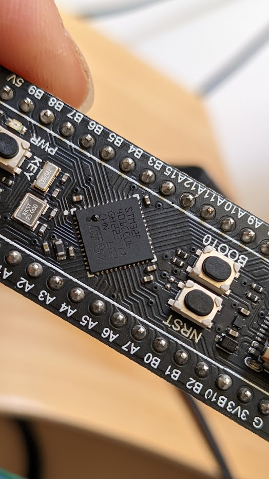

# STM32 pills


- My x2 black-pill-I come from [WeActTogether](https://github.com/WeActTC/MiniSTM32F4x1)
  as seen from USB-IDs in the logs when connectin them.
- [Registered in STM32-base boards](https://stm32-base.org/boards/STM32F401CCU6-WeAct-Black-Pill-V1.2.html)
- Board
  - Name: WeAct Black Pill V1.2
  - Part: Unknown
  - Brand: WeAct Studio
  - Origin: China
- Microcontroller
  - Part: STM32F401CCU6
  - Manufacturer: ST-Microelectronics
  - Core: Arm Cortex-M4
  - Max. Clock Speed: 84MHz
  - Package: UFQFPN 48 pins
- Internal memories
  - FLASH: 256KiB
  - SRAM: 64KiB
- Oscillators:
  - HSI: 16MHz
  - LSI: 32kHz
  - HSE: 25MHz
  - LSE: 32.768kHz
- Power:
  - Sources:
  - Any: +3.3V pin (+3.3V)
  - Any: +5V pin (+5V)
  - USB: connector (+5V)
  - VDDA pin: No
  - VSSA pin: No
  - VREF- pin: No
  - VREF+ pin: No
  - Backup battery: Pin
- Regulator:
  - Manufacturer: Diodes Incorporated
  - Part: AP7343 (6T)
  - Package: X2-DFN1010-4 4 pins
  - Input: +3.52V to +5.25V
  - Output: +3.3V @ 300mA
  - Datasheet: AP7343.pdf
- PCB:
  - Color: Black
  - Size (w x l): 20.78mm x 52.81mm
  - Mounting: Breadboard

## 27 May 2022

- effort: 0.5 (ACC 2022MAY)
- [Blue vs Black pills](https://hackaday.com/2021/01/20/blue-pill-vs-black-pill-transitioning-from-stm32f103-to-stm32f411/)
  with many resources
- [Black-magic fw --> blue-pill](https://satoshinm.github.io/blog/171223_jtagswdpillblink_jtagswd_debugging_via_black_magic_probe_on_an_stm32_blue_pill_and_blinking_a_led_using_stm32cubemx_libopencm3_and_bare_metal_c.html)
 FIT FOR STM32F103xxx ONLY (NOT FOR STM32F4(0 & 1)1, aka black-pill I & II)
- [blue-pill --> Black-magic probe](https://paramaggarwal.medium.com/converting-an-stm32f103-board-to-a-black-magic-probe-c013cf2cc38c)
  DOES NOT WORK
- Flashed BlackMagic following [this guide](https://acassis.wordpress.com/2020/06/07/flashing-the-blackpill-on-linux-using-dfu-util/)
  DOES NOT WORK

  ```logs
  $ dfu-util -d 0483:df11 -a 0 -s 0x08000000:leave -D ~/tmp/t/blackmagic_dfu-swlink.bin
  dfu-util 0.11

  Copyright 2005-2009 Weston Schmidt, Harald Welte and OpenMoko Inc.
  Copyright 2010-2021 Tormod Volden and Stefan Schmidt
  This program is Free Software and has ABSOLUTELY NO WARRANTY
  Please report bugs to http://sourceforge.net/p/dfu-util/tickets/

  dfu-util: Warning: Invalid DFU suffix signature
  dfu-util: A valid DFU suffix will be required in a future dfu-util release
  Opening DFU capable USB device...
  Device ID 0483:df11
  Device DFU version 011a
  Claiming USB DFU Interface...
  Setting Alternate Interface #0 ...
  Determining device status...
  DFU state(10) = dfuERROR, status(10) = Device's firmware is corrupt. It cannot return to run-time (non-DFU) operations
  Clearing status
  Determining device status...
  DFU state(2) = dfuIDLE, status(0) = No error condition is present
  DFU mode device DFU version 011a
  Device returned transfer size 2048
  DfuSe interface name: "Internal Flash  "
  Downloading element to address = 0x08000000, size = 7280
  Erase   	[=========================] 100%         7280 bytes
  Erase    done.
  Download	[=========================] 100%         7280 bytes
  Download done.
  File downloaded successfully
  Submitting leave request...
  Transitioning to dfuMANIFEST state
  ```

## 28 May 2022

- effort: 0.2 (ACC 2022MAY)
- [x] Locate [BlakMagic --> BlackPill guide](https://github.com/koendv/blackmagic-blackpill/blob/main/README_DEVELOPER.md)!!!
  - [x] apply BlakMagic --> BlackPill guide
  - [x] responded to [issue#1  begging for MRs to upstream](https://github.com/koendv/blackmagic-blackpill/issues/1#issuecomment-1143968448)
- [ ] install **ARM gcc/gdb toolchain**
  - [-] `sudo apt install gcc-arm-none-eabi gdb-arm-none-eabi`
    DOES NOT FETCH ANY GDB!!
- [x] download them from https://developer.arm.com/tools-and-software/open-source-software/developer-tools/gnu-toolchain/downloads
  both are missing depends on libpython-3.6
  - [x] `gcc-arm-11.2-2022.02-x86_64-arm-none-linux-gnueabihf.tgz`
  - [x] [install Python3.6 from deadsnakes](https://unix.stackexchange.com/a/188819/156357)
- [ ] build them from sources

## Jun 1 2022

- effort: 1 (ACC 2022JUN)
- [ ] OpenOCD --> BlackMagic
  - [ ] [someone had attempted this](https://github.com/blackmagic-debug/blackmagic/issues/570)
    and was promising (eg debug RTOS threads)...But need re-compile both MBP & OpenOCD.
    - [ ] Have to [build a special OpenOCD](https://github.com/walmis/openocd-blackmagic/)
      instead of cloning [original repo](https://review.openocd.org/q/blackmagic)
      BUILD FAILS [reported as #3](https://github.com/walmis/openocd-blackmagic/issues/3)
    - [x] probably [changes](https://github.com/walmis/blackmagic) already incorporated in blackmagic
    - file [issue#2 begging for MRs to upstream](https://github.com/walmis/openocd-blackmagic/issues/2)
    - file [issue#570 beg also on announce issue](https://github.com/blackmagic-debug/blackmagic/issues/570#issuecomment-1145722893)
- [x] GDB --> BlackMagic
  - [x] follow [Usefull GDB commands](https://github.com/blackmagic-debug/blackmagic/wiki/Useful-GDB-commands)
- [ ] [PlatformIO --> BlackMagic](https://docs.platformio.org/en/stable/plus/debug-tools/blackmagic.html)
  - [ ] [board: STM32F401CC](https://docs.platformio.org/en/stable/boards/ststm32/genericSTM32F401CC.html)
  - [ ] [debug pre-built ELF without building+uploadin](https://community.platformio.org/t/attach-debugger-to-running-program-without-reset/18285)
- [ ] CubIDE -> BlackMagic
- [ ] How to [re-install original WeCanAct BlackPill-1 firmware?](https://github.com/WeActTC/MiniSTM32F4x1/issues/8#issuecomment-627926032)
- Alternative BluePill firmware (discovered from reddit, abandoned since 2016):
  [Versaloon Programmer (VSProg)](https://github.com/zoobab/versaloon)
- [OpenOCD+BMP use-case?](https://www.google.com/search?client=firefox-b-d&q=openocd+black-magic)

## Jun 2 2022

- effort: 0.4 (ACC 2022JUN)
- [x] [WeActTC/MiniSTM32F4x1#37 asked source-code of WeAct fw](https://github.com/WeActTC/MiniSTM32F4x1/issues/37)
- [ ] try to dump orginal's black-pill fw as training
- [Bluepill debug session post](https://devzone.nordicsemi.com/nordic/nordic-blog/b/blog/posts/flashing-and-debugging-nrf5152-with-a-cheap-blackm)

## Jun 3 2022

- work on OpenOCD + Blackpill

## Jun 4 2022

- work on PlatfomIO + Blackpill
