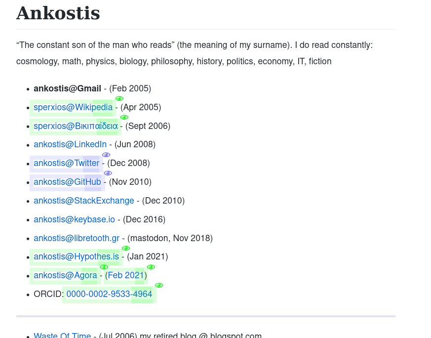
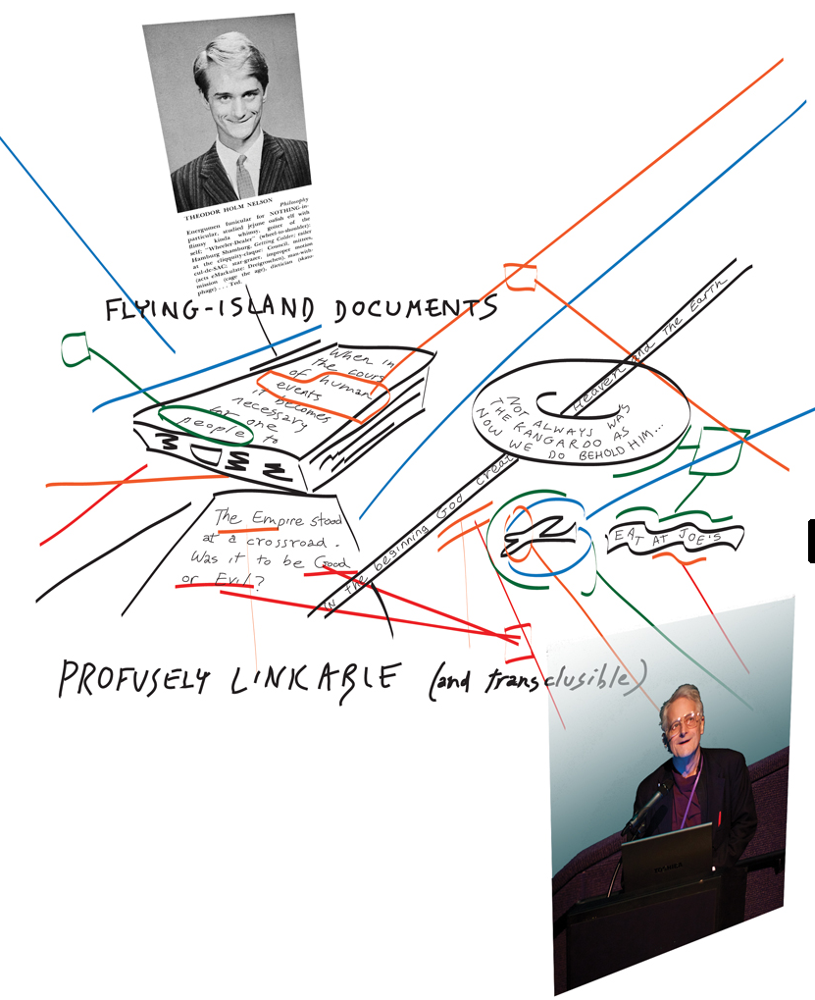
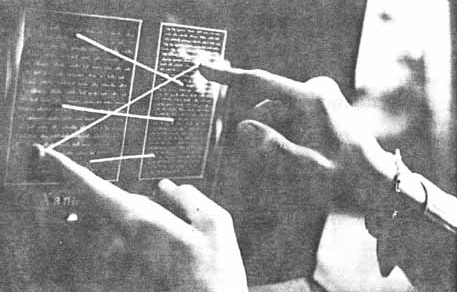
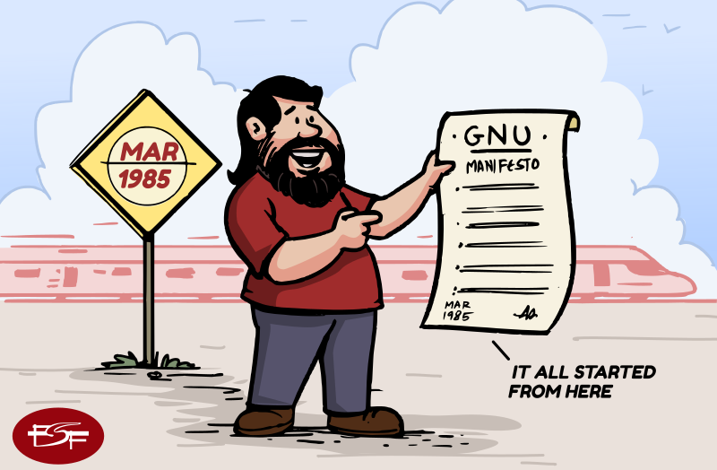
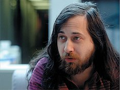
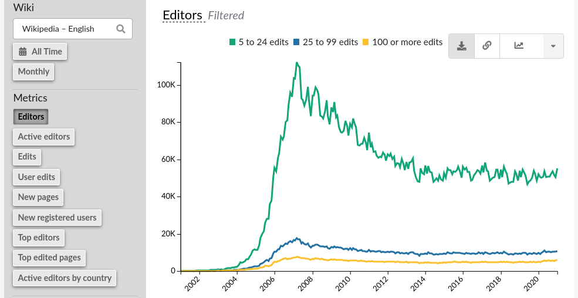

# Hypothes.is Talk in Phaos

> 00:00
> 
> * https://ankostis.io

Καλησπέρα,
Ονομαζομαι Κωστης Αναγνωστοπουλος,
ειμαι ενας εμπειρος προγραμματιστης, σε γονική άδεια.

Ειμαι εδώ για να ΜΑΣ θυμισω, γιατι το web ηταν μια ριζοσπαστική ιδεα,
που θα μας βελτίωνε τις ζωές μας, **συλλογικά**, Δημοκρατικά,
(κατά συνέπεια και τις πόλεις μας),
πότε χάσαμε αυτο το οραμα αυτό στην πορεία?
Και τι μπορούμε να κανουμε σήμερα, για να το ξαναβρουμε.

---

> 00:30
> 
> * In 1963, Ted Nelson's hyperactive(ADHD) mind is infused with ideas which he cannot control.
> * So he lets them take over, and envisions a system to "interconnect" them.

Εν αρχήν, λοιπον, ηταν αυτός εδώ ο τύπος, ο Ted Nelson.
Υπαρχουν πολλές "αρχες" για την ιστορία των υπολογιστών,
αλλα αυτή εδώ ειναι *η πιο παραξενη* που εχω ανακαλύψει.

Γιατι αυτός ο τυπος το 1963 ήταν ενας νεαρός που έπασχε
απο την πρωτοτυπική μορφή της ΔΕΠΥ.
Δεν μπορούσε να συγκεντρωθει, και πήδαγε από τη μία ιδέα στην αλλη.  Συνεχώς.
Γιατί το μυαλό του πλημυρίζει από ιδεες (δεν υπηρχε Ritalin τοτε :-).

Σκεφτηκε λοιπόν αντι να παει κοντρα στη φυση του,
να φτιαξει ενα συστημα που να αντικατοπτρίζει και να βοηθαει τη σκεψη του.
Το ονομασε "μη-σειραϊκή γραφή" αλλά τελικά κράτησε τον πιο πιασαρικό όρο:
**"hypertext"**.

---

> 00:50, 01:18
 > 
> 
> * Ted coined the term "hypertext".
> * He envisioned project "Xanadu" to implement it...
> * an open, collaborative, never-ending set of interconnected records...
> * that has not yet materialized :-)

Βασικό του χαραχτηριστικό ήταν **η ανοιχτότητα**!
ΟΛΟΙ μπορούν να αναπτύξουν & να εξελιξουν οποιο σημειο του περιεχομένου επιλεξουν.
Ολες οι καταγραφες αποθηκευονται και ενοποιούνται σε ενα λειτουργικό υπερσυνολο,
αυτό ηταν το Xanadu.
Πολύ δουλεια.
Ακόμα και σημερα ο Ted και καποιοι πιστοί του προγραμματιστες,
καπου στον πλανητη, προσπαθούν ακόμα να το τελειώσουν,...

---

> 01:40
> 
> 
> * The *Tragedy of the Commons* plagued economist minds since the 19th century.
> * Richard M. Stallman changed the way we cooperate on and share *common* virtual assets.
> * Open-source movement (Eric Raymond) proliferated to all works of society.
> * If only real life institutions (e.g. Major-hall) followed through...

Το 1985, ο Richard Stallman μας χαριζει την εξοχη ιδέα του,
*μετουσιωμενη σε νομικό κείμενο*, την GPL.
Αυτη μας ανοιξε την πορτα σε συνεργασίες μεταξυ αγνώστων,
χιλιάδες χιλόμετρα μακρυα, από τη μια ακρη του πλανήτη στην αλλη.
Αρχικά ΓΙΑ software, μετά ΓΙΑ ολα τα εργα τεχνης, και μη.

---

> 01:51
> 
> * On 1989 Tim Berner Lee implemented WWW and revolutionized internet.
> * While open-ended, it is read-only, localized, and statically linked.
> * client-server model --> *providers* & *users* - users had less power!

Το 1989, 20 χρονια αργοτερα, ο κυριος Λι, "αντιγραφοντας" την ιδεα του Ted,
σηκωνει τον *"παγκόσμιο ιστο"* (μεγάλη επανασταση)
οπου βεβαια δεν ειχε λυθει το ζητημα της *παγκοσμιας συμμετοχής*!
Καθε web-σερβερ ξερει μονο τα του οίκου του, ειναι read-only,
και τα links ειναι στατικα και προαποφασισμενα, και συχνά "σπανε".
Φημολογείται πως το '93, στο Mosaic (ο 1ος browser),
δεν προλαβαν να τελειωσουν ενα feature για Web augmentation από τον καθε χρηστη...

---

> 02:20
> 
> * Wikipedia has been the universal library we envisioned for ages.
> * But very few other, trully global initiatives materialized since.
>   (e.g biology, IT, but no *politics* or *economy*)
> * Discussion happened *elsewhere!*

Το 2001 εχουμε την Wikipedia.
Που πατώντας στα προηγούμενα, προσπαθει να ενωσει την παγκοσμια γνωση.
And that's it!
Αυτό ητανε το τελευταίο project που αποπειράθηκε να διευκολύνει
την παγκόσμιο κοινοτητα να συμμετέχει, *επί ίσοις όροις* στο internet.

Εκει στραβωσε το πραμα.
[Μετά εγκαταλείψαμε!](https://hyp.is/zig9KHbvEeuzpVdDvNG_EQ/www.wired.com/1995/06/xanadu/)

---

> 
> * 1945: *Vanevar Bush* (project **"memex"**)
> * 1963: *Ted Nelson* (project **"Xanadu"**)
> * 1985: *Richard Stallman* (**"GNU Manifesto"**)
> * 1989: *Tim Berner Lee* (**"World Wide Web"**)
> * 2001: *Jimmy Wales* (**"Wikipedia"**)
> * 2000s: GAFA...**all you data belong to us!**

Στο μεταξυ το '98 ειχε ήδη φτιαχτεί η google,
που η παντοδυναμη μηχανή της μας υποσχόταν πως ολα τα blog θα "μετρήσουνε",
και καθε σελίδα θα εχει το μερτικό της στον παγκοσμιο ιστο.

Αλλα επειδή αυτό φυσικά ήταν μια φενακη,
μετά ήρθαν το facebook, twitter, instagram,
και εκει σταματάν οι γνωσεις μου.

---

> 02:52

Και εκεί αρχιναν τα προβλήματα.

Για παραδειγμα, ψανωντας για την παρουσιαση, εφτιαηξα το tag `ιντερνετ`