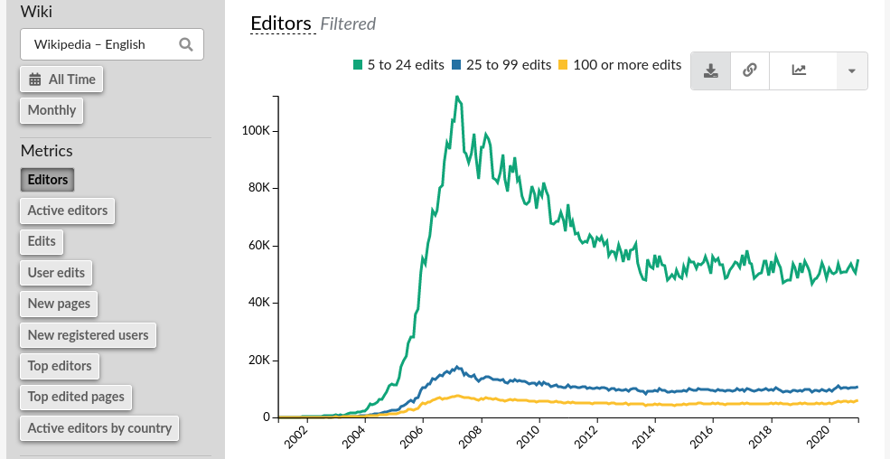

:title: Reviving the Web (and Democracy within)
:skip-help: true
:auto-console: false
:slide-numbers: true
:css: presentation.css

.. footer::

    "Reviving the Web (and Democracy within)", Kostis Anagnostopoulos, 2021

######

Who?  What?  Why?
=================

A tired programmer...
---------------------
| ...but i still like it!

https://ankostis.io
-------------------

| |ankostis urls|

.. note::

   | Καλησπέρα,
   | Ονομαζομαι Κωστης Αναγνωστοπουλος,
   | ειμαι ενας εμπειρος προγραμματιστης, σε γονική άδεια :-)

   | Είμαι εδώ για να ΜΑΣ θυμισω, γιατι το web ηταν μια ριζοσπαστική ιδεα,
   | που θα μας βελτίωνε τις ζωές μας, **συλλογικά**
   | (κατά συνέπεια και τις πόλεις μας),
   | πότε χάσαμε αυτο το οραμα αυτό στην πορεία?
   | Και τι μπορούμε να κανουμε σήμερα, για να το ξαναβρουμε.

######

:data-y: r1000

.. 00:30

(1945) The *conception* of the Web
==================================
(without Ritalin\ |reg|)
------------------------

*  *Vanevar Bush* conceived the **"memex"** project based on "linked" microfilms. |br|
   Impractical!

... but was Ted Nelson’s hyperactive(ADHD) mind
-----------------------------------------------
* infused with ideas which he could not control...
* ... so he let them loose, and envisioned a system to “interconnect” them all.

|Ted Nelson|

.. note::

   | Εν αρχήν, λοιπον, ηταν αυτός εδώ ο τύπος, ο Ted Nelson.
   | Υπαρχουν πολλές “αρχες” για την ιστορία των υπολογιστών,
   | αλλα αυτή εδώ ειναι *η πιο παραξενη* που εχω ανακαλύψει.

   | Γιατι αυτός ο τυπος το 1963 ήταν ενας νεαρός που έπασχε απο την πρωτοτυπική μορφή της ΔΕΠΥ.
   | Δεν μπορούσε να συγκεντρωθει, και πήδαγε από τη μία ιδέα στην αλλη. Συνεχώς.
   | Γιατί το μυαλό του πλημυρίζει από ιδεες (δεν υπηρχε Ritalin τοτε :-).

   | Σκεφτηκε λοιπόν αντι να παει κοντρα στη φυση του, να φτιαξει ενα συστημα
   | που να αντικατοπτρίζει και να βοηθαει τη σκεψη του.
   | Το ονομασε “μη-σειραϊκή γραφή” αλλά τελικά κράτησε τον πιο πιασαρικό όρο:
   | **“hypertext”**.

######

:data-x: r800
:data-y: r0

.. 00:50, 01:18

(1963) Project *Xanadu*
=======================
...that never came to be.
-------------------------
|hypertext| |project-Xanadu|

* *Ted Nelson* coined the term “hypertext”, project “Xanadu” was to implement it.
* an open, collaborative, never-ending set of interconnected records...
* that has not *yet* materialized :-)

.. note::

   | Βασικό του χαραχτηριστικό ήταν **η ανοιχτότητα!**
   | ΟΛΟΙ μπορούν να αναπτύξουν & να εξελιξουν οποιο σημειο του περιεχομένου επιλεξουν.
   | Ολες οι καταγραφες αποθηκευονται και ενοποιούνται
   | σε ενα λειτουργικό υπερσυνολο.
   |
   | Αυτό ηταν το Xanadu.
   | Πολύ δουλεια.
   | Ακόμα και σημερα ο Ted, και καποιοι πιστοί του προγραμματιστες,
   | καπου στον πλανητη, προσπαθούν ακόμα να το τελειώσουν, ...

######

:data-x: r1000
:data-y: r-300

(1985) GNU, Free for All!
=========================
...for the programmers, at least.
---------------------------------

* The *Tragedy of the Commons* plagued economist minds since the 19th century.
* Richard M. Stallman changed the way we cooperate on and share *common* virtual assets.
  |Stallman, circa 2000|
* Open-source movement (Eric Raymond) proliferated to all works of society.

| |The GNU Manifest|

If only real life institutions had followed through...
------------------------------------------------------
...why not, government ministries & local-councils?

.. note::

   | Το 1985, ο Richard Stallman μας χαριζει την εξοχη ιδέα του,
   | *μετουσιωμενη σε νομικό κείμενο*,
   | την GPL.
   | Αυτη μας ανοιξε την πορτα σε συνεργασίες μεταξυ αγνώστων,
   | χιλιάδες χιλόμετρα μακρυα, από τη μια ακρη του πλανήτη στην αλλη.
   | Αρχικά ΓΙΑ software, μετά ΓΙΑ εργα τεχνης, πιο μετα, για ολα.

######

:data-y: r-600

..   01:51

(1989) The birth of the Web
===========================
...by *Tim Berner Lee* @ CERN
-----------------------------
(hint: still alive today, still fighting the same cause)
^^^^^^^^^^^^^^^^^^^^^^^^^^^^^^^^^^^^^^^^^^^^^^^^^^^^^^^^

| |map of the internet|

* While open-ended, ...
* it was read-only, localized, and statically linked.
* The *client-server* model splitted people into *providers* & *users*.
* *Users* had significantly less power!

.. note::

   | Το 1989, 20 χρονια αργοτερα, ο κυριος Λι, “αντιγραφοντας” την ιδεα του Ted,
   | σηκωνει τον *“παγκόσμιο ιστο”* (μεγάλη επανασταση)
   | χωρίς βεβαια να ειχε λυθει το ζητημα της *παγκοσμιας συμμετοχής!*
   | Καθε web-σερβερ ξερει μονο τα του οίκου του, ειναι read-only,
   | και τα links ειναι στατικα και προαποφασισμενα,
   | συχνά “σπανε”.
   |
   | Φημολογείται πως το ’93, στο Mosaic (ο 1ος browser),
   | ΠΑΛΙ δεν προλαβαν να τελειωσουν ενα peer2peer Web augmentation layer
   | από τον καθε χρηστη προς ολους τους άλλους ...

######

:data-y: r-300

.. 02:20

(2001) Wikipedia
================
By the People, For the people
-----------------------------
...last call!
^^^^^^^^^^^^^

|Wikipedia editors statistics|

* Universal library WE envisioned for ages.
* But very few other, truly global initiatives materialized since |br|
  (e.g. biology, IT, but no *politics* or *economy*)

.. note::

   | Το 2001 εχουμε την Wikipedia. Που πατώντας στα προηγούμενα, προσπαθει να
   | ενωσει την παγκοσμια γνωση.
   | And that’s it!
   | Ητανε το τελευταίο μεγάλο "δημόσιο" project που αποπειράθηκε να διευκολύνει την παγκόσμιο κοινοτητα
   | να συμμετέχει, *επί ίσοις όροις* στο internet.
   |
   | Εκει στραβωσε το πραμα.
   | Εκεί εγκαταλείψαμε!

######

:data-x: r400
:data-y: r800

*Discussions that mattered* were already happening *somewhere else*...
======================================================================

######

:data-x: r0
:data-y: r1000
:data-rotate: 90

The Appropriation of the Web started in the '80s
================================================
«Walled gardens»
----------------
| |GAFAM|
| «φοβοῦ τοὺς Δαναοὺς καὶ δῶρα φέροντας»

*all your data belong to us!*
^^^^^^^^^^^^^^^^^^^^^^^^^^^^^
.. class:: substep

* 1980: *Microsoft*: MS-DOS, Windows, GitHub(?)
* 1998: *Google*: google, Gmail, Android
* 2001: *Apple*: MacOS
* 2004: *Facebook*: fb
* ...
* 1974: *NSA*: internet(TCP/IP) :-)

.. note::

   | Στο μεταξυ το ’98 ειχε ήδη φτιαχτεί η Google,
   | η παντοδυναμη μηχανή της μας υποσχόταν πως ολα τα blog θα “μετρήσουνε”,
   | και καθε σελίδα θα εχει το μερτικό της στον παγκοσμιο ιστο.
   |
   | Αλλα επειδή αυτό φυσικά ήταν μια φενάκη,
   | μετά ήρθαν το facebook, twitter, instagram,
   | και εκει σταματάν οι γνωσεις μου, υστερα το "χαος".
   |
   | Και εκεί αρχινάν τα προβλήματα....πως να τους αντικαταστησουμε?

######

:data-x: r200
:data-y: r-2800
:data-rotate: -90

.. 02:52

Free-software fought back!
==========================
| |occupy github|

..with distributed software to Reclaim the  Web!
------------------------------------------------

* Web 2.0,
* p2p
* Distributed Ledgers
* Torrents, Tor
* |IPFS| |NYM|

.. class:: substep

* and help us το reclaim our data
* ... to build personal gardens (of knowledge)
* ... to share & liberate them
* ... fully under our own control.

.. note::

   | Και εκει ξεκιναν οι λύσεις
   | Το αποπειραθήκαμε το 2000 με τα blogs ... δεν φτούρισαν.
   |
   | Αλλα το ξερουμε, η λυση αυτή ειναι, να γινουμε *ολοι παραγωγοι*,
   | (όμως να μας ανηκουν τα μεσα παραγωγής, σωστα? ;-)
   |
   | Αλλά και να μπορούμε να μοιραστούμε τα προϊόντα μας, ευκολα.
   |
   | Και φυσικά ΠΡΩΤΑ ππορεποει να παρουμε πισω τα δεδομένα μας!
   |
   | Και ΤΑ FACEBOOKS, σιγουρα δεν θελου κατι τετοιο!
   | Τα APIs συνεχως κλεινουν το ενα μετα το αλλο
   | (πίσω από "paywalls")

######

:data-x: r800
:data-y: r1000
:data-rotate: 0

But what about "us", humble users?
==================================
.. class: substep

| |breadcrumbs|

.. class:: substep

* We can start annotating right now our walks around the Web!

   * **W3C Web-annotations**

      * <live demo>

.. note::

   **TODO: αυριο το live demo!**

   | Μας λειπουν βεβαια και καποια "προχωρημενα" εργαλεια,
   | για server-less  για να κανουν την ενασχοληση μας παραγωγικη.

   | Για παραδειγμα, ψαχνωντας για την παρουσιαση,
   |
   | εφτιαξα το tag ``ιντερνετ``

######

:data-x: 2600
:data-y: 800
:data-scale: 4.0
:data-z: 1000
:data-rotate-x: -60

Thank you
=========
27 Feb 2021, Phaos space
------------------------
Kalamata
--------

.. note::

   * 1945: *Vanevar Bush* (project **“memex”**)
   * 1963: *Ted Nelson* (project **“Xanadu”**)
   * 1985: *Richard Stallman* (**“GNU Manifesto”**)
   * 1989: *Tim Berner Lee* (**“World Wide Web”**)
   * 2001: *Jimmy Wales* (**“Wikipedia”**)

######

:data-x: 2800
:data-y: -200
:data-z: 1200
:data-rotate-x: 0

.. |reg| replace:: :sup:`®`
.. |br| raw:: html

   

.. |ankostis urls| image:: images/ankostis-urls.png
   :width: 600px
.. |Ted Nelson| image:: images/TedNelson-xanadu.png
   :width: 400px
.. |hypertext| image:: images/hypertext-1963.png
   :width: 300px

.. |The GNU Manifest| image:: images/GNU-manifesto-comic.png
   :width: 400px
.. |Stallman, circa 2000| image:: images/RMS.png

.. |GAFAM| image:: images/GAFAM.png
   :width: 500px
.. |occupy github| image:: images/occupy-github.png
   :width: 300px
.. |IPFS| image:: images/IPFS-logo.png
   :height: 64px
.. |NYM| image:: images/NYM-logo.png
   :height: 64px

