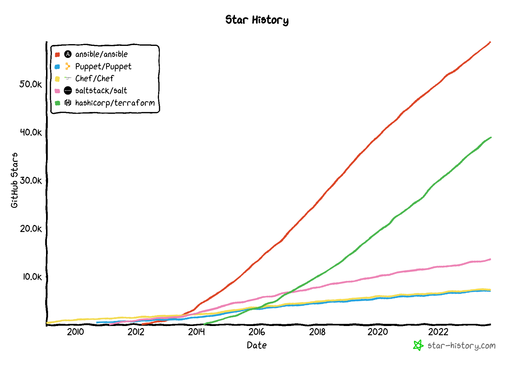

# IaC

- Candidates
  - Terraform (OpenTofu)
  - CloudFormation
  - Ansible
  - Chef
  - Puppet
  - Salt
  - NixOS
- Comparisons:
  - [stars-history](https://star-history.com/#ansible/ansible&Puppet/Puppet&Chef/Chef&saltstack/salt&hashicorp/terraform&Date)
    
  - [Terraform alts (2022)](https://medium.com/@opo1234567/11-terraform-alternative-2e03b3678ad2)
  - [Puppet, Salt, Chef & Ansible (2020)](https://www.liquidweb.com/kb/puppet-salt-chef-ansible-a-comparison/)
  - [Homemade report on Ansible, Chef, Puppet, SaltStack, CFEngine (2015)](https://gist.github.com/jaceklaskowski/bd3d06489ec004af6ed9)
  - [Terraform Vs Ansible](https://www.geeksforgeeks.org/difference-between-terraform-vs-ansible/)
  - [Detailed Terraform Vs Ansible](https://k21academy.com/ansible/terraform-vs-ansible/)
  - [nixOS vs Ansible discourse thread](https://discourse.nixos.org/t/nixos-vs-ansible/16757/20)
  - [Ansible + nix post](https://github.com/WeAreWizards/blog/blob/master/content/articles/ansible-and-nix.md)
  - [Nix after Ansible impressions](https://mtlynch.io/notes/nix-first-impressions/)
